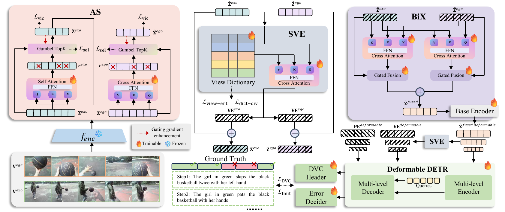
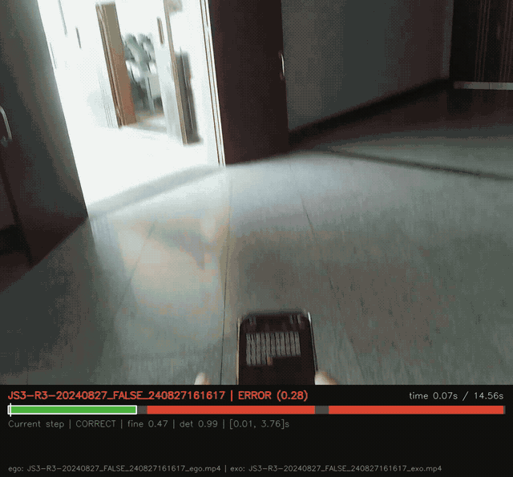

<div align="center">

# SAVA-X

**SAVA-X: Ego-to-Exo Imitation Error Detection via Scene-Adaptive View Alignment and Bidirectional Cross-View Fusion**

**CVPR 2026 Accepted Paper**

<p>
  <a href="https://arxiv.org/abs/2603.12764"></a>
  <a href="https://cvpr.thecvf.com/"></a>
  <a href="LICENSE"></a>
  <a href="https://github.com/jack1ee/SAVAX"></a>
  <a href="https://github.com/jack1ee/SAVAX/releases"></a>
  <a href="https://huggingface.co/datasets/HeqianQiu/EgoMe"></a>
</p>

<p>
  <a href="https://arxiv.org/abs/2603.12764">Paper</a> |
  <a href="https://huggingface.co/datasets/HeqianQiu/EgoMe">Dataset</a> |
  <a href="#citation">Citation</a>
</p>

</div>

<p align="center">
  <a href="figs/method.pdf">
    
  </a>
</p>

<p align="center">
  Main Method Diagram
</p>

## Overview

`SAVA-X` studies a practical cross-view procedural understanding setting: a third-person `Exo` demonstration is used to assess whether a first-person `Ego` imitation is correct. Given asynchronous and length-mismatched ego/exo videos, the model must localize step segments on the ego timeline and determine whether each step is correct or erroneous.

This repository provides the maintained training and evaluation pipeline for the CVPR 2026 paper, including:

- the `SAVA-X` model and maintained configs
- the paired `EgoMe` annotation contract used by the codebase
- training and evaluation scripts for ego/exo imitation error detection
- baseline integration notes in [baselines/README.md](baselines/README.md)

## Updates

- `2026-02`: `SAVA-X` was accepted to `CVPR 2026`.
- `2026-04`: the public codebase was released.

## Core Modules

SAVA-X is built around an `Align-Fuse-Detect` design that addresses three core difficulties in Ego-to-Exo imitation error detection:

- `Adaptive sampling`: keeps informative segments and reduces redundancy in long procedural videos
- `Scene-adaptive view alignment`: injects scene-aware view embeddings to narrow the ego/exo domain gap
- `Bidirectional cross-view fusion`: exchanges complementary cues between exocentric demonstrations and egocentric executions

## EgoMe Dataset

This repository uses annotations derived from the official `EgoMe` release:

- dataset card: [HeqianQiu/EgoMe](https://huggingface.co/datasets/HeqianQiu/EgoMe)
- dataset paper: [EgoMe: A New Dataset and Challenge for Following Me via Egocentric View in Real World](https://arxiv.org/abs/2501.19061)

The official annotation package stores each split as a single JSON file such as `train.json`, `val.json`, `test.json`, and `total.json`. Inside each file, the real annotations live under the top-level `annotations` dictionary, and each video entry contains fields such as:

- `View`
- `Match video`
- `Duration`
- `Coarse-level`
- `Fine-level`
- `Split`

## Setup

Recommended software environment:

- Python `>= 3.8`
- PyTorch with CUDA support
- Java runtime for `METEOR`

Install PyTorch and torchvision first. On GPU machines, choose the wheel that
matches your CUDA toolkit from the official PyTorch installer:

```bash
python3 -m pip install torch torchvision
```

Then install the remaining Python dependencies:

```bash
python3 -m pip install -r requirements.txt
```

Build the deformable attention operator:

```bash
cd SAVAX/ops
python3 setup.py build install
cd ../..
```

## Data Format

The maintained code path expects paired `EgoMe`-style JSON annotation files:

- `train_Ego_cap.json`
- `train_Exo_cap.json`
- `train_Ego_para.json`
- `train_Exo_para.json`
- `val_Ego_cap.json`
- `val_Exo_cap.json`
- `val_Ego_para.json`
- `val_Exo_para.json`
- `test_Ego_cap.json`
- `test_Exo_cap.json`
- `test_Ego_para.json`
- `test_Exo_para.json`

### Convert Official EgoMe Annotations

To convert the official `EgoMe` annotation format into the paired files used by this repository, run:

```bash
python utils/convert_egome_annotations.py \
  --input-dir /path/to/EgoMe_Annotation \
  --output-dir /path/to/EgoMe_Annotation/converted
```

The `*_cap.json` files keep per-step `timestamps` and `sentences`. The `*_para.json` files store one paragraph string per video by concatenating the ordered step descriptions, which is the format used by paragraph-level caption evaluation.

Ego and Exo files are paired by base id. Keys may end with `_ego` or `_exo`; the loader strips these suffixes before pairing.

Feature folders are configured separately:

- `ego_feature_folder`
- `exo_feature_folder`

Supported feature storage:

- LMDB features: `features.lmdb` with `shapes.json`
- raw `.npy` features on disk, controlled by `visual_feature_type`

Supported `visual_feature_type` values in the maintained path:

- `tsp`: features can be extracted with the official `TSP` repository, [HumamAlwassel/TSP](https://github.com/HumamAlwassel/TSP)
- `videomae`: features can be extracted with `MMAction2`, [open-mmlab/mmaction2](https://github.com/open-mmlab/mmaction2)

## Training

Use YAML as the source of truth for model, data, and runtime settings.

```bash
python3 train_SAVAX.py \
  --cfg_path "cfgs/SAVA-X/train/standard.yml"
```

Runtime overrides such as `--id`, `--gpu_id`, `--device`, `--start_from`, and `--start_from_mode` remain available.

## Evaluation

```bash
python3 eval_SAVAX.py \
  --cfg_path "cfgs/SAVA-X/eval/standard.yml" \
  --re_eval
```

Evaluation restores training-time model options from the corresponding `info.json` while keeping evaluation-specific overrides, including:

- `eval_model_path`
- `eval_folder`
- `eval_device`
- `eval_visual_feature_type`
- `eval_video_feature_folder`

## Inference Visualization

Use `infer_visualize.py` to run inference on selected Ego/Exo pairs and render the
raw `ego` video with a bottom panel that shows:

- the predicted overall correctness of the imitation
- the current predicted step caption
- whether the current step is predicted as `CORRECT` or `ERROR`
- a compact timeline of all predicted step segments

The script still uses the paired annotation files and feature folders from the evaluation config; the extra CLI arguments are only for locating raw videos and choosing which samples to render.

### Example



### Single Pair

```bash
python infer_visualize.py \
  --cfg_path cfgs/SAVA-X/eval/5fps_standard.yml \
  --output_dir outputs/vis_single \
  --sample_key <sample_id> \
  --ego_video /path/to/raw/ego/<sample_id>.mp4 \
  --exo_video /path/to/raw/exo/<sample_id>.mp4
```

If the raw filename stem already matches the annotation key, `--sample_key` can
be inferred from the video name by pointing to the corresponding video
directories instead of explicit file paths.

### Batch From Ego/Exo Folders

```bash
python infer_visualize.py \
  --cfg_path cfgs/SAVA-X/eval/5fps_standard.yml \
  --output_dir outputs/vis_batch \
  --ego_video_dir /path/to/raw/Ego \
  --exo_video_dir /path/to/raw/Exo \
  --max_samples 20
```


## Repository Structure

- `SAVAX/`: main model, criterion, transformer modules, and custom ops
- `cfgs/SAVA-X/`: maintained training and evaluation configurations
- `data/`: dataset loaders and annotation utilities
- `densevid_eval3/`: dense video captioning and imitation evaluation utilities
- `misc/`: utility modules reused by training and evaluation
- `baselines/`: auxiliary baseline implementations notes

## Baselines
Upstream repositories, task adaptation details, and baseline-specific notes are provided in [baselines/README.md](baselines/README.md).

## License

The original code in this repository is released under the MIT License. See [LICENSE](LICENSE).

Files or subdirectories that carry their own copyright notices, license headers, or bundled license files remain subject to their respective original terms. Redistribution should preserve all applicable third-party notices and license texts.

## Third-Party Components and Licenses

| Component | Upstream project | Upstream repository | License / notice |
| --- | --- | --- | --- |
| `SAVAX/SAVAX.py` | PDVC | [ttengwang/PDVC](https://github.com/ttengwang/PDVC) | MIT |
| `SAVAX/base_encoder.py`, `SAVAX/deformable_transformer.py`, `SAVAX/matcher.py`, `SAVAX/position_encoding.py`, `SAVAX/ops/`, `misc/detr_utils/misc.py` | Deformable DETR | [fundamentalvision/Deformable-DETR](https://github.com/fundamentalvision/Deformable-DETR) | Apache-2.0 |
| `misc/detr_utils/box_ops.py`, portions of `SAVAX/*` and `misc/detr_utils/misc.py` | DETR | [facebookresearch/detr](https://github.com/facebookresearch/detr) | Apache-2.0 |
| `SAVAX/ops/` source files | Deformable Convolution v2 implementation | [chengdazhi/Deformable-Convolution-V2-PyTorch](https://github.com/chengdazhi/Deformable-Convolution-V2-PyTorch) | See upstream repository and preserved source headers |
| `SAVAX/ops/src/cuda/ms_deform_im2col_cuda.cuh` | Deformable ConvNets | [msracver/Deformable-ConvNets](https://github.com/msracver/Deformable-ConvNets) | See upstream repository and preserved source headers |
| `densevid_eval3/evaluate2018.py`, `densevid_eval3/para_evaluate.py`, parts of `densevid_eval3/eval_imitation.py` | densevid_eval | [ranjaykrishna/densevid_eval](https://github.com/ranjaykrishna/densevid_eval) | MIT |
| `densevid_eval3/pycocoevalcap/` | pycocoevalcap | [salaniz/pycocoevalcap](https://github.com/salaniz/pycocoevalcap) | Bundled `license.txt`; `bleu/` includes its own bundled license |
| `densevid_eval3/SODA/` | SODA | [fujiso/SODA](https://github.com/fujiso/SODA) | Software Evaluation License distributed with the bundled copy |

Additional notes:

- Some files in `densevid_eval3/` contain local modifications and separate copyright statements in addition to upstream notices.
- Some files in `SAVAX/` and `misc/` combine code paths derived from multiple upstream repositories; the original file-header notices should remain intact.
- Redistribution of bundled third-party code should be reviewed component by component, especially for evaluation packages with separate bundled licenses.

## Citation

If this repository is useful in your research, please cite the `SAVA-X` paper:

```bibtex
@article{li2026savax,
  title={SAVA-X: Ego-to-Exo Imitation Error Detection via Scene-Adaptive View Alignment and Bidirectional Cross-View Fusion},
  author={Li, Xiang and Qiu, Heqian and Wang, Lanxiao and Qiu, Benliu and Meng, Fanman and Xu, Linfeng and Li, Hongliang},
  journal={arXiv preprint arXiv:2603.12764},
  year={2026}
}
```

If you use the `EgoMe` dataset, please also cite:

```bibtex
@article{qiu2025egome,
  title={EgoMe: A New Dataset and Challenge for Following Me via Egocentric View in Real World},
  author={Qiu, Heqian and Shi, Zhaofeng and Wang, Lanxiao and Xiong, Huiyu and Li, Xiang and Li, Hongliang},
  journal={arXiv preprint arXiv:2501.19061},
  year={2025}
}
```

